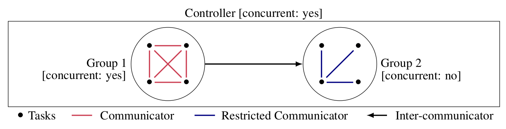

# pFactory - A generic library for designing parallel solvers

[](https://travis-ci.org/crillab/pfactory)
[](https://sonarcloud.io/dashboard?id=crillab_pFactory)
[](https://github.com/crillab/pfactory/blob/master/LICENSE)

<div style="text-align: justify">
pFactory is a parallel library designed to support and facilitate the implementation of parallel solvers in C++. It provides robust implementations of parallel algorithms and allows seamlessly sharing mechanisms, divide-and-conquer or portfolio methods. pFactory is not related to a specific problem and can very easily be incorporated in order to solve any kind of combinatorial problem (SAT, CSP, MAXSAT...).
</div>

<p align="center">

</p>

<div style="text-align: justify">
We aim to produce a tool that is accessible while remaining efficient and without being intrusive. To address this challenge, pFactory now proposes three principal objects: groups, communicators, and controllers (as depicted in the figure). These objects have been designed to be modular and thus, can be operated to design and personalize a broad spectrum of parallel strategies. A group expresses a collection of tasks to be performed by a set of threads (represented by the circles in the figure). Moreover, the user can choose to start a group concurrently, which makes possible the implementation of portfolio based solvers. A controller handles a set of groups and deals with some functionalities (s.t. start, stop, . . . ) on these groups. For example, to wait simultaneously for the end of all tasks, or to activate the concurrent mode on a set of group. A communicator allows sharing information easily between threads. We provide different kinds of communicators, helping to design different sharing mechanism topologies. The object called Communicator<T> uses templates. Thus it is possible to share any kind of informations (vector, int...). A dedicated and powerful algorithms to exchange such informations is provided. More informations are given in the following paper:
</div>
<br>
pFactory: A generic library for designing parallel solvers, the 16th International Conference on Applied Computing (AC 2019).
Gilles Audemard, Gael Glorian, Jean-Marie Lagniez, Valentin Montmirail and Nicolas Szczepanski


## Installation instructions

### Dependencies
This libary needs:
 - a C++11 compiler
 - the pthread library

### Installation 
 

In the directory pFactory:
```console
./configure
```

```console
make
```

The created library ```libpFactory.a``` is in the directory ```lib/```

Note to developpers: editing pFactory may require the [autotools](https://www.gnu.org/software/automake/manual/html_node/Autotools-Introduction.html).

## User Manual

The main method of pFactory is the constructor ```pFactory::Group(unsigned int nbThreads)``` which create a Group object. 
An instance of the class group represents:
  - a set of threads ```std::thread```
  - a set of tasks ```std::function<int()>```

Tasks are added thanks to the method ```Group::add(std::function<int()> function)``` 
using C++11 lambdas and are launched by the method ```Group::start()```. 
Of course, we can have more tasks than threads and in this case, a queue of work is 
created and all tasks are executed. To finish, the method ```Group::wait()```  waits 
that all tasks are completed (only one if the concurrent mode is activated in the method ```start```) 
and join all threads. 

The library contains an efficient sharing mechanism.
Once the group object created, you can link a communicator that is in charge of the communication 
between threads. To this end: 
- Create a communicator (in this example, the communicator can share integers between threads): 
``` pFactory::Communicator<int>* integerCommunicator(&group);```. 
    Variable ```group``` is an  instance of ```Factory::Group``` object defined above. 
- Send int to other threads using the method ```send(int)```:
-   Receive integers from other threads. Two methods achieve this task:
    - using the method ```void recvAll(std::vector<int> &data)```. 
    In this case, the vector data receives all data.
    - using the method ```std::pair<bool, int> recv();```. In this case, one can receive
    data one by one. The first element of the pair becomes true if there is 
    no more data to receive. 


## Examples

### Example 1: Hello World

```cpp
#include "pFactory.h"

// In this example, we create a group of thread saying hello world
int main(){
  // A group of nbCores threads 
  pFactory::Group group(pFactory::getNbCores());
  // Add as many tasks as threads in the group
  for(unsigned int i = 0; i < pFactory::getNbCores();i++){
    group.add([&](){
          // pFactory::cout() provides a special critical section for displaying information
	      pFactory::cout() << group.getTask() << " says Hello World" << std::endl;
	      return 0;
      });
  }
  // Start the computation of all tasks
  group.start();
  // Wait until all threads are performed all tasks 
  group.wait();
}

```


### Example 2 : Communications

```cpp
#include "pFactory.h"
#include <mutex>

// In this example, each thread share an integer to the others.
// The mutex is used only for displaying data in a smart way.
// Of course, on classical usage, this mutex is useless, you
// can directly share and receive data

int main()
{
    // A group of nbCores threads
    pFactory::Group group(pFactory::getNbCores());
    pFactory::MultipleQueuesCommunicator<int> integerCommunicator(&group);
    std::mutex m;

    for (unsigned int i = 0; i < pFactory::getNbCores(); i++)
    {
        // Add as many tasks as threads in the group
        group.add([&, i]() {
            // Send a random number
            m.lock(); // Only to be able to display data in a smart way
            int nb = rand() % 101;
            std::cout << "Thread (or task)" << i << " sends: " << nb << std::endl;
            integerCommunicator.send(nb);
            m.unlock();

            //Receive and display all numbers of others threads
            std::vector<int> data;
            integerCommunicator.recvAll(data);
            m.lock(); // Only to be able to display data in a smart way
            std::cout << "Thread (or task)" << i << " receives:";
            for (unsigned int j = 0; j < data.size(); ++j)
                std::cout << data[j] << ' ';
            std::cout << std::endl;
            m.unlock();
            return 0;
        });
    }
    // Start the computation of all tasks
    group.start();
    // Wait until all threads are performed all tasks
    group.wait();
}
```

### Example 3

You can also [download](http://www.cril.univ-artois.fr/~audemard/pfactory-glucose.tgz) an implementation of the [SAT solver glucose](https://www.labri.fr/perso/lsimon/glucose/) in parallel mode (aka named syrup)
using the library pFactory. Such implementation integrates clauses sharing mechanism.


## Authors

Main author
 - Nicolas Szczepanski - szczepanski.nicolas@gmail.com


Other contributors
 - Gilles Audemard - audemard@cril.fr
 - Jean-Marie Lagniez - jmlagniez@gmail.com


## Contact
Do not hesitate to contact pfactory@cril.fr if you encounter any problems with pFactory.
