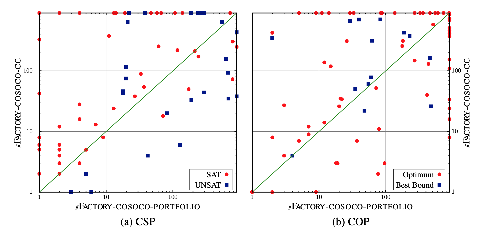

We choose to parallelize Cococo, a CP solver.%
This solver is written in C++ (which is required to be used
with \library) and it participated to the last XCSP
competitions.
Experiments were run on the instances of the XCSP'18 competition and a
computer containing 4 Xeon processors. Benchmarks as well
as the source code of Cosoco  are available [here](http://www.cril.univ-artois.fr/XCSP19)

Experiments were run on the following architecture.
Each processor has 20 cores at 2.4 GHz, making 80 cores
available per solver per instance.
The runtime limit was set to 900 seconds for each instance and the
memory limit was set to 768 GB.
Logs are available at [https://bit.ly/2W6WqJr](https://bit.ly/2W6WqJr).

Two parallel CP solvers have been designed: a concurrent parallel
solver and a divide-and-conquer one [1]. 

The portfolio solvers jsut change some heuristics and parameters in order to 
diversify the search. Concerning the concurrent method, the diversification of the solvers
have been ensure by using with different restart strategies and value
heuristics.
To decompose the formula we choose to use the simpler algorithm that is presented in [1]. 
For the divide-and-conquer method, a very basic procedure of
decomposition has been implemented (unlike the one proposed
in [1] which is based on a look-ahead decomposition).
Our decomposition procedure selects the n best variables according
to the heuristic dom/deg  and it generates the cartesian product of their domain.
The goal is to obtain at least 100 sub-problems per solver.
Thus, with our configuration of 80 cores, a minimum of 8000
sub-problems must be produced.
Even if this is not the optimal division strategy, our main objective
is not to design the best parallel solver but to show that our library
easily allows the design of divide-and-conquer approaches.
Actually the decomposition procedure is something important but not
primordial to evaluate the effectiveness of pFactory.

For each approach, a communicator is used to exchange assignments or
refutations that have been proven true by a solver at the top of the
tree search.
For COP problems, another communicator is also used to share bounds
between the different solvers.
Thus, when a better bound is found by a worker, all workers take
advantage of it.
Except for those required to duplicate the initial problem, all
alterations done in Cosoco are marginal (less than 200 lines).

The following table  gives a pairwise comparison of the two
parallel solvers. For CSP problems, we provide the number of instances solved.
For COP problems, we provide the the number of times the optimum is found and the number of times 
a bound is provi

|                  |     | CSP   |       |     | COP   |       |
|---------------------------|-----|-------|-------|-----|-------|-------|
|                     | SAT | UNSAT | TOTAL | OPT | BOUND | TOTAL |
| Cosoco                    | 49  | 24    | 73    | 60  | 197   | 257   |
| pFactory-cosoco-cc        | 66  | 29    | 95    | 78  | 190   | 268   |
| pFactory-cosoco-portfolio | 86  | 33    | 119   | 82  | 196   | 278   |

The following scatter plots provide a comparison between instances, both for CSP and COP problems.
Each dot represents an instance. x and y axis represent time. Each dot below (resp. above) the diagonal 
expresses an instance solved faster  by the concurrent method (resp. the portoflio method).
 
 

[1] Arnaud Malapert, Jean-Charles Régin, Mohamed Rezgui:
Embarrassingly Parallel Search in Constraint Programming. J. Artif. Intell. Res. 57: 421-464 (2016)