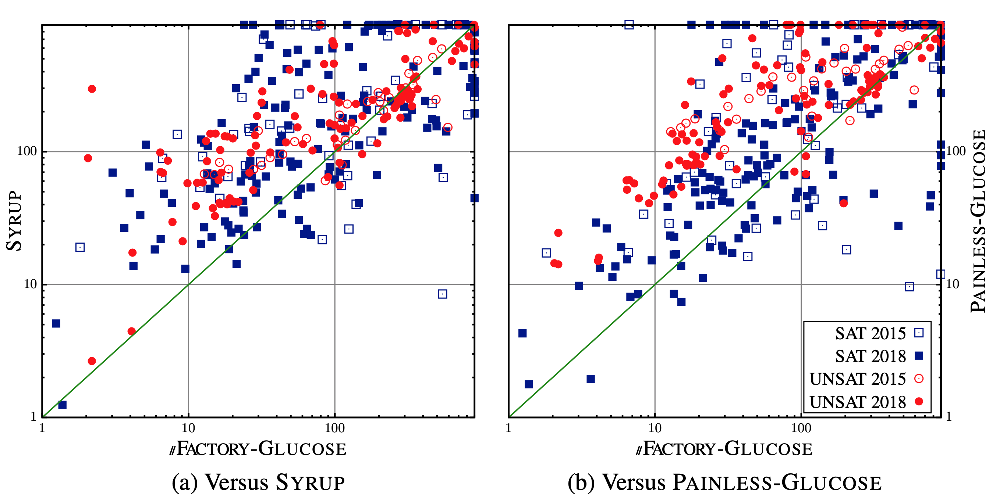

## SAT experiments

Experiments were run on the following architecture.
Each processor has 20 cores at 2.4 GHz, making 80 cores
available per solver per instance.
The runtime limit was set to 900 seconds for each instance and the
memory limit was set to 768 GB.
Logs are available at [https://bit.ly/2W6WqJr](https://bit.ly/2W6WqJr).
 Besides the 100 instances of the parallel track of the 2015 SAT competition, we also considered 
 400  benchmarks originating from the application track of the 2018 SAT competition. 

all the parallel solvers implemented in this paper are based on the same sequential SAT solver: 
[GLUCOSE 4.1](https://www.labri.fr/perso/lsimon/glucose/).
 These solvers are: PAINLESS-GLUCOSE (the authors kindly provided a GLUCOSE- based version),  SYRUP
 (the official parallel version of GLUCOSE) and our solver, called pFACTORY-GLUCOSE. 
 The same strategy as the one used in SYRUP has been implemented to share the learnt clauses. 
 
 
 
 
 The following table highlights the results achieved by the different approaches we considered. 
 As we can see, on the set of problems considered, //FACTORY-GLUCOSE clearly outperforms SYRUP and PAINLESS- GLUCOSE. 
 
 
|                  |     | 2015  |       |     | 2018  |       |
|------------------|-----|-------|-------|-----|-------|-------|
|                  | SAT | UNSAT | TOTAL | SAT | UNSAT | TOTAL |
| Glucose          | 9   | 6     | 15    | 67  | 66    | 133   |
| Painless-Glucose | 42  | 32    | 74    | 141 | 99    | 240   |
| Syrup            | 43  | 32    | 75    | 141 | 114   | 255   |
| pFactory-Glucose | 49  | 32    | 81    | 149 | 114   | 263   |
 
 
 
We also provide an apple-to-apple comparison between pFACTORY-GLUCOSE 
against SYRUP  and PAINLESS-GLUCOSE. 
The scatter plots show that our solver is generally faster than the two others. 
Particularly, the cumulated solving time for the instances that are solved by all solvers are, 
respectively, for PAINLESS-GLUCOSE, SYRUP, and pFACTORY-GLUCOSE, 4h47m, 3h29m, and 2h48m for the SAT’15 instances, 
and, 10h34m, 10h01m, and 7h05m for SAT’18 ones. Regarding pFACTORY-GLUCOSE, it is comparable to a gain of 20% (resp.29%) 
versus SYRUP and 41% (resp. 33%) versus PAINLESS-GLUCOSE on the SAT’15 (resp. SAT’18) instances. 
 
  

